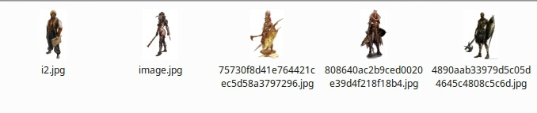
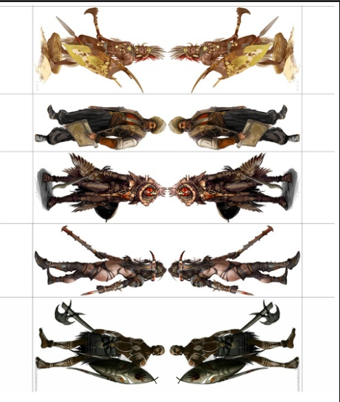

# create_paper_mins

На основе каталога изображений генерирует ленту бумажных миниатюр для печати на бумаге. В процессе генерации: 
- обрезает лишние куски фона, центрируя изображение 
- поворачивает, для создания ряда
- зеркалит (смотрите пример ниже). 

## Опции запуска 

| Опция | Описание |
|---|---|
| work_dir | Директория, откуда брать изображения. Работает с вложенными директориями, итоговые имена(чтобы исключить перезатирание) генерируются на основе отметки времени. | 
| out | Директория, куда складывать результат. Если не указана, то в текущую. | 
| width | Ширина исходящих изображений ( включая зеркалированную сторону и подставку ). |
| glue | Cклеивать ли в один лист. Принимает значения yes/no |

## Установка зависимостей
```python
$ pip install -r requirements.txt
```

## Пример запуска 
```python
$ python3 run.py -work_dir /path/to/my_image -out /path/to/out_image -width 600 -glue yes 
```

Не знаю будет ли работать под виндой, но старался писать кроссплатформенно. 


## Пример работы

Пример сделан с белым фоном, но на самом деле цвет фона не важен, главное чтобы он был одного цвета в рамках конкретной миниатюры.

Дан каталог с разными картинками персонажей:



После работы программы лента под печать:



## TODO

- Менять фон у изображений на один для всех. Сейчас оставляет фон, который был изначальный, у каждого изображения свой. Проблема: влоб не решается, т.к. заменит теже пиксели внутри картинки. Идея к решению: меняем там, где ищем пики для кропа, собираем массив точек.
- Линии отреза сделать пунктирами, так же сделать кружок у подставки.
- Масштабирование с возможностью замастить на А4, когда пользователь указывает выходные размеры в мм. Проблема: не могу пока получить DPI. Идея к решению: могу получить DPI через сохранение картинки в определенном DPI - костыль, который мне не нравится.
- Шумы на изображении. Нет проблем, нужно время. 
- Вырезать изображение с цветного фона.